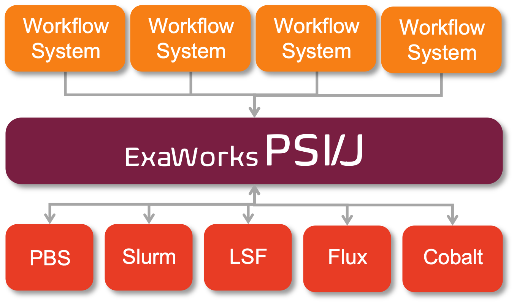

Getting Started
===============

Who PSI/J is for
----------------

PSI/J is a library intended to make your job-launching code portable, or at
least easier to port, across
HPC centers. If you want your project to be able to request resources
from one or more of Slurm, LSF, Flux, Cobalt, PBS, and your local machine,
we think you will find that PSI/J simplifies your work considerably.

Who PSI/J is (probably) not for
-------------------------------

If you were sure that you will only *ever* be launching jobs on ORNL's Summit
system, and you don't care about any other cluster or machine, then you may as well
interact with LSF (the resource manager on Summit) directly, rather than
indirectly through PSI/J. In that case PSI/J would not really be adding much
other than complexity.

If you write application code that is meant to run on various HPC clusters, but
which never make calls to the underlying resource manager (e.g. by calling into
Flux's client library, or executing ``srun``/``jsrun``/``aprun`` etc.), then
PSI/J will not help you. This is likely your situation if you work on a MPI-based
science simulation, since we have observed that it is often the users' responsibility
to actually launch the simulation through the resource manager.
However, PSI/J is more likely to help with various tools
associated with your simulation--for instance, your test suite.

Terminology and "job" vs ``Job``
--------------------------------

In PSI/J's terminology, a resource manager job is an executable
plus a bunch of attributes. Generally, when jobs are submitted, they will
need to sit in the queue for a variable amount of time, depending on how
busy the cluster is. Then the job will be started, the executable will
run to completion, and the job will be marked as completed.

PSI/J's ``Job`` objects are representations of underlying resource manager
jobs. One ``Job`` instance might represent a Slurm job running on a LLNL cluster,
another a Cobalt job running on ALCF's Theta, another a Flux job on the cloud, and
so on.

However, a newly-created ``Job`` object does not represent any resource manager
job, it is a kind of free agent. To convert it to a resource manager job, the
``Job`` needs to be submitted to a ``JobExecutor`` instance. That action
creates a new resource manager job and permanently binds the ``Job`` to it.
Alternatively, a ``Job`` can be bound to an *existing* resource manager job by
calling ``JobExecutor.attach``, passing in a ``Job`` and the ID of the underlying
resource manager job.

Basic Usage
-----------

The most basic way to use PSI/J looks something like the following:

#. Create a ``JobExecutor`` instance.
#. Create a ``JobSpec`` object and populate it with information about your job.
#. Create a ``Job`` with that ``JobSpec``.
#. Submit the ``Job`` instance to the ``JobExecutor``.

That's all there is to it! Assuming there are no errors, you should
see a new entry in your resource manager's queue. On a Slurm cluster,
this code might look like:

.. code-block:: python

    from psij import Job, JobExecutor, JobSpec

    ex = JobExecutor.get_instance('slurm')
    job = Job(JobSpec(executable='/bin/date'))
    ex.submit(job)

The ``executable='/bin/date')`` part tells PSI/J that we want the job to run
the ``/bin/date`` command. Once that command has finished executing
(which should be almost as soon as the job starts) the resource manager
will mark the job as complete, triggering PSI/J to do the same.

And by way of comparison, here is the same functionality on an LSF cluster:

.. code-block:: python

    from psij import Job, JobExecutor, JobSpec

    ex = JobExecutor.get_instance('lsf')
    job = Job(JobSpec(executable='/bin/date'))
    ex.submit(job)

Note that the only difference is the argument to the ``get_instance`` method.

Adding Complexity
-----------------

Multiple Jobs
^^^^^^^^^^^^^

In the last section we submitted a single job, and didn't check
whether it succeeded or failed.

Submitting multiple jobs is as simple as adding a loop:

.. code-block:: python

    from psij import Job, JobExecutor, JobSpec

    ex = JobExecutor.get_instance('flux')
    for _ in range(100):
        job = Job(JobSpec(executable='/bin/date'))
        ex.submit(job)

Every ``JobExecutor`` can handle arbitrary numbers of jobs.
Most of the functionality provided by ``JobExecutor`` is
contained in the ``submit`` and ``attach`` methods.

Checking Job Completion
^^^^^^^^^^^^^^^^^^^^^^^

In all the above examples, we have submitted jobs without
checking on what happened to them.

To wait for a job to complete once it has been submitted, it suffices
to call the ``wait`` method with no arguments:

.. code-block:: python

    from psij import Job, JobExecutor, JobSpec

    job = Job(JobSpec(executable='/bin/date'))
    ex.submit(job)
    job.wait()

The ``wait`` call will return once the job has reached
a terminal state, which almost always means that it finished or was
cancelled.

To distinguish jobs that complete successfully from ones that fail or
are cancelled, fetch the status of the job after calling ``wait``:

.. code-block:: python

    job.wait()
    print(str(job.status))

Status Callbacks
^^^^^^^^^^^^^^^^

Waiting for jobs to complete with ``wait()`` is fine if you don't
mind blocking while you wait for a single job to complete. However,
if you want to wait on multiple jobs without blocking, or you want
to get updates when jobs start running, you can attach a callback
to a ``JobExecutor`` which will fire whenever any job submitted to that
executor changes status.

To wait on multiple jobs at once:

.. code-block:: python

    import time
    from psij import Job, JobExecutor, JobSpec

    count = 100

    def callback(job, status):
        global count

        if status.final:
            print(f"Job {job} completed with status {status}")
            count -= 1

    ex = JobExecutor.get_instance('flux')
    ex.set_job_status_callback(callback)
    for _ in range(count):
        job = Job(JobSpec(executable='/bin/date'))
        ex.submit(job)

    while count > 0:
        time.sleep(0.01)

Job Information
---------------

So far we have been assuming that your job is very simple--you just want to
run ``/bin/date`` and there is no mention of node, MPI rank, or GPU counts,
or of different partitions/queues, and all the other resource manager
concepts you may be familiar with.

However, much of what you wish to specify is supported (although we hope it all is).

Resources
^^^^^^^^^
To specify your job's resources, like GPUs and nodes, create a
``ResourceSpecV1`` and set it with ``JobSpec(..., resources=my_spec_v1)``.

Launching Methods
^^^^^^^^^^^^^^^^^
To specify how the processes in your job should be started once resources have been
allocated for it, pass the name of a launcher (e.g. ``"mpirun"``, ``"srun"``, etc.)
like so: ``JobSpec(..., launcher='srun')``.

Scheduling Information
^^^^^^^^^^^^^^^^^^^^^^
To specify resource-manager-specific information, like queues/partitions,
runtime, and so on, create a ``JobAttributes`` and set it with
``JobSpec(..., attributes=my_job_attributes)``.
