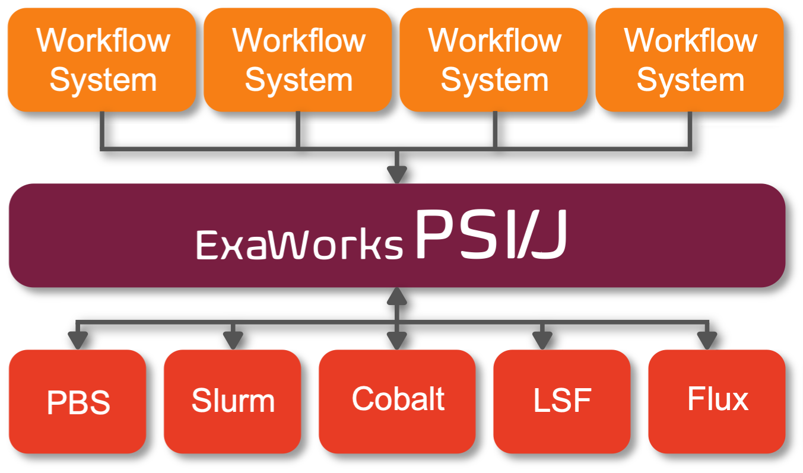

===============================================================
Portable Submission Interface for Jobs (PSI/J) - Python Library
===============================================================

PSI/J provides a modern unified API across different HPC schedulers, enabling
your HPC application to run virtually anywhere.  PSI/J automatically translates
abstract job specifications into concrete scripts and commands to send to the
scheduler. PSI/J was built by a team with decades of experience building
workflow systems for large scale computing. PSI/J has a number of advantages:

#. **Runs entirely in user space:** No need to wait for infrequent deployment cycles, it's easy to leverage built-in or commmunity-provided plug-ins.

#. **An asynchronous modern API for job management:** A clean Python API for requesting and managing jobs.

#. **Supports the common batch schedulers:** We test PSI/J across multiple DOE supercomputer centers. It's easy to test PSI/J on your systems and share the results with the community.

#. **Built by the HPC community, for the HPC community:** PSI/J is based on a number of libraries used by state-of-the-art HPC workflow applications.

#. **PSI/J is an open source project:** We are establishing a community to develop, test, and deploy PSI/J across many HPC facilities.

Most HPC centers now feature multiple schedulers, rolling policy changes and
deployments of software stacks, and subtle differences even across systems with
similar architectures. **PSI/J is designed to tame this complexity** and provide
computational scientists and workflow developers a common API for interacting
with HPC centers.

.. toctree::
    :maxdepth: 3

    getting_started
    user_guide
    api
    development/index.rst
