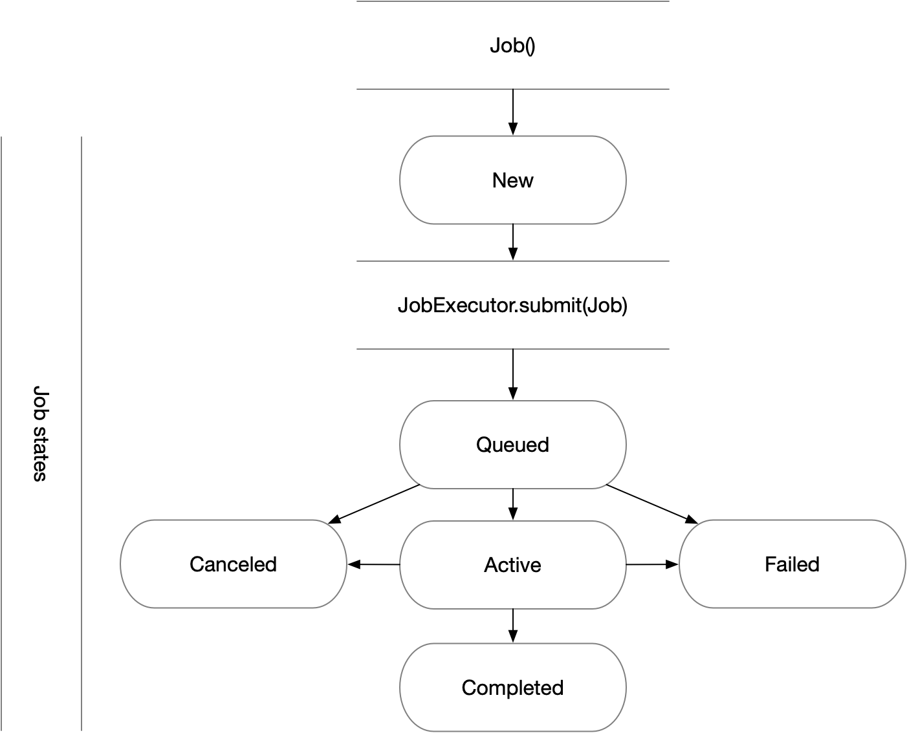

User Guide
==========

Who PSI/J Is for
----------------

PSI/J is a Python library for submitting and managing HPC jobs via arbitrary
Resource Managers (RMs). PSI/J abstracts the specific RM, making your code
RM-independent and portable, or at least easier to port, across HPC centers.  If
you want your project to be able to request resources from one or more of Slurm,
LSF, Flux, Cobalt, PBS, and your local machine, we think you will find that
PSI/J simplifies your work considerably.

Who PSI/J Is (Probably) Not for
-------------------------------

If you are sure that you will only *ever* be launching jobs on ORNL's Summit
system, and you don't care about any other cluster or machine, then you may as
well interact with LSF (the resource manager on Summit) directly, rather than
indirectly through PSI/J. In that case PSI/J would not really be adding much
other than complexity.

If you write application code that is meant to run on various HPC clusters, but
which never makes calls to the underlying resource manager (e.g. by calling into
Flux's client library, or executing ``srun``/``jsrun``/``aprun`` etc.), then
PSI/J will not help you. This is likely your situation if you are a developer
working on a MPI-based science simulation, since we have observed that it is
often the users' responsibility to actually launch the simulation through the
resource manager.  However, PSI/J is more likely to help with various tools
associated with your simulation--for instance, your test suite.

Terminology
-----------

What is a Job?
^^^^^^^^^^^^^^

In PSI/J’s terminology, a :class:`Job <psij.job.Job>` represents an underlying
resource manager job.  One :class:`Job <psij.job.Job>` instance might represent
a Slurm job running on a LLNL cluster, another a Cobalt job running on ALCF's
Theta, another a Flux job in the cloud, and so on.

A :class:`Job <psij.job.Job>` is described by an executable plus job attributes which specify how
exactly the job is executed.  Static job attributes such as resource
requirements are defined by the :class:`JobSpec <psij.job_spec.JobSpec>` at
creation. Dynamic job attributes such as the :class:`JobState
<psij.job_state.JobState>` are modified by :class:`JobExecutors
<psij.job_executor.JobExecutor>` as the :class:`Job <psij.job.Job>`
progresses through its lifecycle.

What is a JobExecutor?
^^^^^^^^^^^^^^^^^^^^^^

A :class:`JobExecutor <psij.job_executor.JobExecutor>` represents a specific RM,
e.g. Slurm, on which the job is being executed.  Generally, when jobs are
submitted they will be queued for a variable period of time, depending on how
busy the target machine is. Once the job is started, its executable is
launched and runs to completion, and the job will be marked as completed.

In PSI/J, a job is submitted by passing a :class:`Job <psij.job.Job>` instance
to the :meth:`JobExecutor.submit <psij.job_executor.JobExecutor.submit>`
function.  Alternatively, a :class:`Job <psij.job.Job>` instance can be bound to
an *existing* resource manager job by passing it and the ID of the underlying
resource manager job to :meth:`JobExecutor.attach
<psij.job_executor.JobExecutor.attach>`.

.. image:: psij_arch.png

PSI/J currently provides executors for the following backends:

  - `local` : run jobs on localhost
  - `flux`  : `Flux Scheduling Framework <https://flux-framework.org/>`_
  - `slurm` : `Slurm Scheduling System <https://slurm.schedmd.com/>`_
  - `lsf`   : `IBM Spectrum LSF <https://www.ibm.com/docs/en/spectrum-lsf>`_
  - `pbspro`: `Altair's PBS-Professional <https://www.altair.com/pbs-professional>`_
  - `cobalt`: `ALCF's Cobalt job scheduler <https://www.alcf.anl.gov/support/user-guides/theta/queueing-and-running-jobs/job-and-queue-scheduling/index.html>`_

We encourage the contribution of executors for additional backends—please
reference the `developer documentation
<development/tutorial_add_executor.html>`_ for details.

Submit a Job
------------

The most basic way to use PSI/J looks something like the following:

1. Create a ``JobExecutor`` instance.
2. Create a ``JobSpec`` object and populate it with information about your job.
3. Create a ``Job`` with that ``JobSpec``.
4. Submit the ``Job`` instance to the ``JobExecutor``.

On a Slurm cluster, this code might look like:

.. rst-class:: executor-type-selector selector-mode-tabs

Slurm // Local // LSF // PBS // Cobalt

.. code-block:: python

    from psij import Job, JobExecutor, JobSpec

    ex = JobExecutor.get_instance("<&executor-type>")
    job = Job(JobSpec(executable='/bin/date'))
    ex.submit(job)

And by way of comparison, other backends can be selected with the tabs above.
Note that the only difference is the argument to the ``get_instance`` method.

The ``JobExecutor`` implementation will translate all PSI/J API activities into the
respective backend commands and run them on the backend, while at the same time
monitoring the backend jobs for failure, completion or other state updates.

Assuming there are no errors, you should see a new entry in your resource
manager’s queue after running the example above.

Multiple Jobs
^^^^^^^^^^^^^

In the last section we submitted a single job.  Submitting multiple jobs is as
simple as adding a loop:

.. rst-class:: executor-type-selector selector-mode-tabs

Slurm // Local // LSF // PBS // Cobalt

.. code-block:: python

    from psij import Job, JobExecutor, JobSpec

    ex = JobExecutor.get_instance("<&executor-type>")
    for _ in range(10):
        job = Job(JobSpec(executable="/bin/date"))
        ex.submit(job)

Every :class:`JobExecutor <psij.job_executor.JobExecutor>` can handle arbitrary
numbers of jobs (tested with up to 64k jobs).

Configuring Your Job
--------------------

In the example above, the ``executable='/bin/date'`` part tells PSI/J that we want
the job to run the ``/bin/date`` command. But there are other parts to the job
which can be configured:

- Arguments for the job executable
- Environment the job is running in
- Destination for standard output and error streams
- Resource requirements for the job's execution
- Accounting details to be used

That information is encoded in the ``JobSpec`` which is used to create the
``Job`` instance.

Job Arguments
^^^^^^^^^^^^^

The executable's command line arguments to be used for a job are specified as
a list of strings in the arguments attribute of the ``JobSpec`` class.  For
example, our previous ``/bin/date`` job could be changed to request UTC time
formatting:

.. rst-class:: executor-type-selector selector-mode-tabs

Slurm // Local // LSF // PBS // Cobalt

.. code-block:: python

    from psij import Job, JobExecutor, JobSpec

    ex = JobExecutor.get_instance('<&executor-type>')
    job = Job(JobSpec(executable='/bin/date', arguments=['-utc', '--debug']))
    ex.submit(job)

Note: `JobSpec` attributes can also be added incrementally:

.. code-block:: python

    from psij import JobSpec

    spec = JobSpec()
    spec.executable = '/bin/date'
    spec.arguments = ['-u']

Job Environment
^^^^^^^^^^^^^^^

The job environment sets the environment variables for a job before it is
launched. This is the equivalent of exporting ``FOO=bar`` on the command line
before running a command. These environment variables are specified as
a dictionary of string key/value pairs:

.. code-block:: python

    from psij import JobSpec

    spec = JobSpec()
    spec.executable = '/bin/date'
    spec.environment = {'TZ': 'America/Los_Angeles'}

Environment variables specified this way will overwrite settings from your shell
initialization files (`e.g., ~/.bashrc`), including from any modules loaded in
the default shell environment.

Job Stdio
^^^^^^^^^

Standard output and standard error streams of the job can be individually
redirected to files by setting the ``stdout_path`` and ``stderr_path`` attributes:

.. code-block:: python

    from psij import JobSpec

    spec = JobSpec()
    spec.executable = '/bin/date'
    spec.stdout_path = '/tmp/date.out'
    spec.stderr_path = '/tmp/date.err'

A job's standard input stream can also be redirected to read from a file by
setting the ``spec.stdin_path`` attribute.

Job Resources
^^^^^^^^^^^^^

A job submitted to a cluster is allocated a specific set of resources to run on.
The number and type of resources are defined by a resource specification,
``ResourceSpec``, which becomes part of the job specification.  The resource
specification supports the following attributes:

  - ``node_count``: Allocate that number of compute nodes to the job.  All
    cpu-cores and gpu-cores on the allocated node can be exclusively used by the
    submitted job.
  - ``processes_per_node``: On the allocated nodes, execute that given number of
    processes.
  - ``process_count``: The total number of processes (MPI ranks) to be started.
  - ``cpu_cores_per_process``: The number of cpu cores allocated to each launched
    process.  PSI/J uses the system definition of a cpu core, which may refer to
    a physical cpu core or to a virtual cpu core (also known as a hardware thread).
  - ``gpu_cores_per_process``: The number of gpu cores allocated to each launched
    process.  The system definition of a gpu core is used, but usually refers
    to a full physical GPU.
  - ``exclusive_node_use``: When this boolean flag is set to ``True``, then PSI/J
    will ensure that no other jobs, neither from the same user nor from other users
    of the same system, will run on any of the compute nodes on which processes
    for this job are launched.

A resource specification does not need to define all available attributes. In
fact, an empty resource spec is valid as it refers to a single process being
launched on a single cpu core.

The user should also take care not to define contradictory statements.  For
example, the following specification cannot be enacted by PSI/J as the specified
node count contradicts the value of ``process_count / processes_per_node``:

.. code-block:: python

    from psij import JobSpec, ResourceSpec

    spec = JobSpec()
    spec.executable = '/bin/stress'
    spec.resource_spec = ResourceSpec(node_count=2, processes_per_node=2,
            process_count=2)
    # the line above should raise an 'psij.InvalidJobException' exception

Processes Versus Ranks
""""""""""""""""""""""

All processes of a job will share a single MPI communicator
(`MPI_COMM_WORLD`), independent of their placement, and the term `rank` (which
usually refers to an MPI rank) is thus equivalent.  However, jobs started with
a single process instance may, depending on the executor implementation, not get
an MPI communicator.  How jobs are launched can be specified by the `launcher`
attribute of the ``JobSpec``, as documented below.

Launching Methods
^^^^^^^^^^^^^^^^^

To specify how the processes in your job should be started once resources have been
allocated for it, pass the name of a launcher (e.g. ``"mpirun"``, ``"srun"``, etc.)
like so: ``JobSpec(..., launcher='srun')``.

Scheduling Information
^^^^^^^^^^^^^^^^^^^^^^

To specify resource manager-specific information, like queues/partitions,
runtime, and so on, create a :class:`JobAttributes
<psij.job_attributes.JobAttributes>` and set it with ``JobSpec(...,
attributes=my_job_attributes)``:

.. rst-class:: executor-type-selector selector-mode-tabs

Slurm // Local // LSF // PBS // Cobalt

.. code-block:: python

    from psij import Job, JobExecutor, JobSpec, JobAttributes, ResourceSpecV1

    executor = JobExecutor.get_instance("<&executor-type>")

    job = Job(
        JobSpec(
            executable="/bin/date",
            resources=ResourceSpecV1(node_count=1),
            attributes=JobAttributes(
                queue_name="<QUEUE_NAME>", project_name="<ALLOCATION>"
            ),
        )
    )

    executor.submit(job)

The `<QUEUE_NAME>` and `<ALLOCATION>` fields will depend on the system you are
running on.

Managing Job State
------------------

In all the above examples, we have submitted jobs without checking on what
happened to them. Once the job has finished executing (which, for `/bin/date`,
should be almost as soon as the job starts) the resource manager will mark the
job as complete, triggering PSI/J to do the same via the :class:`JobStatus
<psij.job_status.JobStatus>` attribute of the job.  ``Job`` state
progressions follow this state model:

Waiting for Completion
^^^^^^^^^^^^^^^^^^^^^^

To wait for a job to complete once it has been submitted, it suffices
to call the :meth:`wait <psij.job.Job.wait>` method with no arguments:

.. code-block:: python

    from psij import Job, JobSpec

    job = Job(JobSpec(executable="/bin/date"))
    ex.submit(job)
    job.wait()

The :meth:`wait <psij.job.Job.wait>` call will return once the job has reached
a terminal state, which almost always means that it finished or was
canceled.

To distinguish jobs that complete successfully from ones that fail or
are canceled, fetch the status of the job after calling
:meth:`wait <psij.job.Job.wait>`:

.. code-block:: python

    job.wait()
    print(str(job.status))

Canceling Your Job
^^^^^^^^^^^^^^^^^^

If supported by the underlying job scheduler, PSI/J jobs can be canceled by
invoking the :meth:`cancel <psij.job.Job.cancel>` method.

Status Callbacks
^^^^^^^^^^^^^^^^

Waiting for jobs to complete with :meth:`wait <psij.job.Job.wait>` is fine if
you don't mind blocking while you wait for a single job to complete. However, if
you want to wait on multiple jobs without blocking or you want to get updates
when jobs start running, you can attach a callback to a :class:`JobExecutor
<psij.job_executor.JobExecutor>` which will fire whenever any job submitted to
that executor changes status.

To wait on multiple jobs at once:

.. rst-class:: executor-type-selector selector-mode-tabs

Slurm // Local // LSF // PBS // Cobalt

.. code-block:: python

    import time
    from psij import Job, JobExecutor, JobSpec

    count = 10

    def callback(job, status):
        global count

        if status.final:
            print(f"Job {job} completed with status {status}")
            count -= 1

    ex = JobExecutor.get_instance("<&executor-type>")
    ex.set_job_status_callback(callback)

    for _ in range(count):
        job = Job(JobSpec(executable="/bin/date"))
        ex.submit(job)

    while count > 0:
        time.sleep(0.01)

Status callbacks can also be set on individual jobs with
:meth:`set_job_status_callback <psij.job.Job.set_job_status_callback>`.
