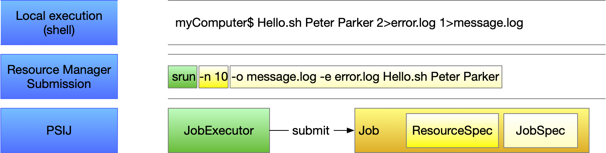
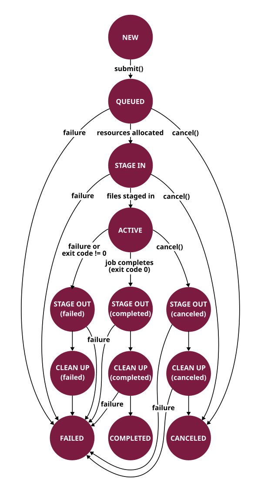
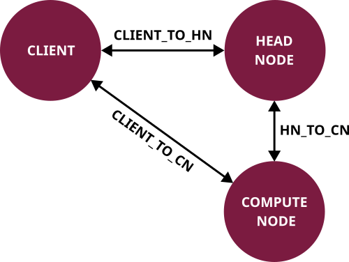

User Guide
==========

PSI/J Python is an implementation of the
`PSI/J specification <https://exaworks.org/job-api-spec/specification>`_, which
is an API for abstracting HPC job management over local resource managers
(LRMs), such as Slurm, LSF, and PBS.

Overview of the PSI/J API
-------------------------

The PSI/J API can be logically split into two parts:
1. The **core classes**, which describe jobs in an abstract fashion,
independent of how and where they are executed

2. **Executors and launchers**, which implement specific mechanisms of executing
jobs, such as running them on a SLURM cluster.

Core classes
^^^^^^^^^^^^

The essential core classes are:

:class:`Job <psij.Job>`
    Represents an abstract job which has a formal specification represented by
    a ``JobSpec`` instance as well as a ``JobStatus``, which indicates, for
    example, whether the job is running or completed.

    :class:`JobSpec <psij.JobSpec>`
        Formally specifies all static aspects of a job, such as the executable
        to run, the arguments, input/output redirection, as well as LRM
        attributes (``JobAttributes``) and cluster resources needed
        (``ResourceSpec``).

        :class:`JobAttributes <psij.JobAttributes>`
            Describes LRM attributes, such as the queue where the job is
            to be sent to or a project name that is used for accounting
            purposes.

        :class:`ResourceSpec <psij.ResourceSpec>`
            The resource specification indicates the resources required by the
            job, such as the number of nodes. The ``ResourceSpec`` class is an
            abstract class with multiple possible concrete implementations.
            However, :class:`ResourceSpecV1 <psij.ResourceSpecV1>` is
            currently the only concrete implementation.

    :class:`JobStatus <psij.JobStatus>`
        The ``JobStatus`` class contains information about the position of the
        job in its lifecycle and consists of a
        :class:`JobState <psij.JobState>` and various metadata associated with
        state transition events.

The following diagram highlights similarities between components of a PSI/J
job, a typical shell executable invocation, and a standard LRM job:

|

Executors and Launchers
^^^^^^^^^^^^^^^^^^^^^^^

Job :class:`executors <psij.JobExecutor>` implement the specific mechanisms
needed to run jobs. For example, the ``local`` job executor can be used to run
jobs locally, by forking a sub-process, whereas the ``Slurm`` executor can be
used to run jobs through the Slurm resource manager. The PSI/J Python library
currently provides the following executors:

    * ``cobalt``: `ALCF's Cobalt job scheduler <https://www.alcf.anl.gov/support/user-guides/theta/queueing-and-running-jobs/job-and-queue-scheduling/index.html>`_
    * ``flux``: `Flux Scheduling Framework <https://flux-framework.org/>`_
    * ``local``: run jobs locally
    * ``lsf``: `IBM Spectrum LSF <https://www.ibm.com/docs/en/spectrum-lsf>`_
    * ``pbs``: `Altair's PBS-Professional <https://www.altair.com/pbs-professional>`_ and variations, such as OpenPBS.
    * ``slurm``: `Slurm Scheduling System <https://slurm.schedmd.com/>`_

For a complete list of executors provided by this library, please see
:ref:`Available Executors <available-executors>`.

Instances of the :class:`Launcher <psij.Launcher>` class are used
indirectly (i.e., user code does not directly instantiate ``Launcher`` objects;
this is done automatically by the ``JobExecutor`` based on information in the
``JobSpec``) to tell the ``JobExecutor`` how to launch the job. The term
"launch" is specific to LRMs and generally represents the mechanism used to
start a parallel job on multiple compute nodes from the job's lead node once
the job resources (compute nodes) are allocated by the LRM. Examples of
launchers include ``mpirun``, ``srun``, ``ibrun``, etc.

The Job Lifecycle
-----------------

The basic flow of a PSI/J ``Job`` is as follows:

    * Instantiate a ``Job`` object with an appropriate ``JobSpec`` and relevant
      attributes and resource specification.
    * Obtain a ``JobExecutor`` instance using
      :meth:`.JobExecutor.get_instance`.
    * Submit the ``Job`` instance to the ``JobExecutor`` instance.
    * The status of a job can be monitored using either an asynchronous callback
      mechanism or, synchronously, using :meth:`.Job.wait`.

The following sections provide concrete details on how these steps can be
achieved.

Creating a Job
^^^^^^^^^^^^^^

A ``Job`` can be created by instantiating a :class:`psij.Job` object together
with a :class:`psij.JobSpec`, which describes the details of the job:

.. smartinclude:: ../tests/user_guide/test_plain_job.py
    :section: job

The shell equivalent of this job is:

.. code-block:: bash

    $ /bin/date

Specifying the Job Details
^^^^^^^^^^^^^^^^^^^^^^^^^^

The example above creates a ``Job`` that will run the ``/bin/date`` executable.
A number of other ``Job`` details can be specified:

   * The arguments to be passed to the executable.
   * The environment variables visible to the job.
   * Redirection of input, output, and error streams.
   * Cluster resource requirements for the job's execution.
   * Various parameters specific to the LRM.

Job Arguments
+++++++++++++

The executable's command line arguments to be used for a job are specified as
a list of strings in the ``arguments`` attribute of the ``JobSpec`` instance.
For example, our previous ``/bin/date`` job could be changed to request UTC
time formatting:

.. smartinclude:: ../tests/user_guide/test_job_arguments.py

``JobSpec`` properties can also be modified directly after the ``JobSpec``
instance is created:

.. smartinclude:: ../tests/user_guide/test_simple_job_with_props.py

The shell equivalent for both of these jobs is:

.. code-block:: bash

    $ /bin/date --utc

Environment Variables
+++++++++++++++++++++

Environment variables that are accessible by the job can be set using
the ``environment`` attribute of :class:`psij.JobSpec`, which is a dictionary
with ``str`` keys and values:

.. smartinclude:: ../tests/user_guide/test_environment.py

Environment variables set this way will override prior values of the same
environment variable. The shell equivalent of the above job is:

.. code-block:: bash

    $ TZ=America/Los_Angeles /bin/date

Redirection
+++++++++++

The ``stdin_path`` attribute of :class:`psij.JobSpec` can be used to specify a
standard input stream for the job, whereas the ``stdout_path`` and
``stderr_path`` attributes can be used to redirect the output and error
streams, respectively. The values should be :class:`pathlib.Path` objects
(although strings are also accepted). It is recommended that the paths be
absolute to avoid ambiguities. An example of output/error redirection is shown
below:

.. smartinclude:: ../tests/user_guide/test_redirect.py

The shell equivalent of this example is:

.. code-block:: bash

    $ /bin/date 1>/tmp/date.out 2>/tmp/date.err

Job Resources
+++++++++++++

A job submitted to a cluster is allocated a specific set of resources to run
on. The number and type of resources can be defined through a resource
specification, represented by the :class:`psij.ResourceSpecV1` class, and
attached to the ``resources`` attribute of :class:`psij.JobSpec`. The
resource specification (V1) supports the following attributes:

``node_count``
    Allocates that number of compute nodes to the job.

``processes_per_node``
    On the allocated nodes, executes that number of processes.

``process_count``
    The total number of processes (MPI ranks) to be started.

``cpu_cores_per_process``
    The number of CPU cores allocated to each launched process.

``gpu_cores_per_process``
    The number of GPU cores allocated to each launched process.

``exclusive_node_use``
    When this boolean flag is set to ``True``, PSI/J will ask the LRM to ensure
    that no other jobs, whether from the same user or from other users, will
    run on any of the compute nodes allocated for this job. If this flag is set
    to ``False``, the LRM will use a default setting.

The meaning of certain terms in the resource specification, such as
``CPU core``, may depend on how the LRM is configured for that system. For,
example a CPU core may refer to a physical core or to a thread in the sense of
Intel's *Hyperthreading* or AMD's *Simultaneous Multi-Threading* technologies.

A resource specification does not need to define all available attributes. In
fact, an empty resource spec is valid as it refers to a single process being
launched on a single cpu core.

The following snippet creates a job that requests 2 compute nodes with 4
processes on each node, for a total of 8 processes:

.. smartinclude:: ../tests/user_guide/test_resourcespec.py

.. note::
    All processes of a job will share at most one MPI communicator
    (``MPI_COMM_WORLD``), independent of their placement, and the term ``rank``
    (which usually refers to an MPI rank) is thus equivalent to that of
    ``process``. Depending on the job launcher used (e.g., ``multiple``), jobs
    may not get an MPI communicator.

Job Launching
^^^^^^^^^^^^^

In principle, one of the main jobs of a PSI/J ``JobExecutor``, the submission,
stops when the LRM allocates resources for the job and an executable is started
on the *lead node* of the job (the precise nature of this *lead node* or its
exact name will vary from system to system, and *head node* or *service node*
are also common.)

In order to run the job on all the allocated nodes, the job needs to be
``launched`` using a ``launcher``, such as ``mpirun``. The launcher is the
entity that, when invoked on the lead node, starts all of the job's processes
on the compute nodes. Recommendations specific to the cluster where the job is
launched should be followed when selecting a launcher.

To specify the launcher to be used, use the ``launcher`` property of
:class:`~psij.JobSpec` and set it to one of the available launchers, such as
``mpirun``. For a complete list of launchers, please see
:ref:`Available Launchers <available-launchers>`.

Once a job is launched, the job executable is run in ``process_count``
instances, distributed on the compute nodes according to the job's resource
specification. However, it is often desirable to run certain commands that are
needed to configure the job environment only once rather than as part of each
process. This is the case with ``module load xyz`` commands, which can be very
resource-demanding if run as part of each job process. Such commands are better
invoked before the job is launched. The PSI/J :class:`~psij.JobSpec` provides
the ``pre_launch`` and ``post_launch`` properties, which are paths to user
scripts that are guaranteed to be invoked only once for a job, before the job
is launched and after all the job processes complete, respectively. The
``pre_launch`` and ``post_launch`` scripts are run on the lead node of the job
and are *sourced*. That means that any environment variables exported by the
``pre_launch`` script will be made available to the job (under the assumption
that the launcher will propagate the environment to the individual ranks).

Module Loading
++++++++++++++

A typical and frequent task that ``pre_launch`` is supposed to address is that
of loading `environment modules <https://modules.sourceforge.net/>`_. Running
``module load`` is somewhat resources expensive and doing so on each compute
node for a large job can exacerbate this. Consequently, the recommended way
of loading modules is on the lead node, before the job is launched, as the
following example shows:

.. smartinclude:: ../tests/user_guide/test_prelaunch.py

where the contents of ``pre_launch.sh`` is

.. literalinclude:: ../tests/user_guide/pre_launch.sh
    :language: bash
    :lines: 1, 20-21

Scheduler Information
^^^^^^^^^^^^^^^^^^^^^

Information specific to LRMs, like queues/partitions, runtime, and so on,
can be specified using the ``attributes`` property of :class:`~psij.JobSpec`
and an instance of the
:class:`JobAttributes <psij.job_attributes.JobAttributes>` class:

.. smartinclude:: ../tests/user_guide/test_scheduling_information.py

where `QUEUE_NAME` is the LRM queue where the job should be sent and
`ACCOUNT` is a project/account that may need to be specified for
accounting purposes. These values generally depend on the system and allocation
being used.

Submitting Jobs
^^^^^^^^^^^^^^^

When a ``Job`` is instantiated, it is in the
:attr:`JobState.NEW <psij.JobState.NEW>` state. That is,
``job.status.state == JobState.NEW``. A job in the ``NEW`` state can be
*submitted* to an executor. In order to obtain an executor instance, the
:func:`JobExecutor.get_instance <psij.JobExecutor.get_instance>` static method
can be used with an executor type as parameter. The executor type can be any of
the names returned by
:func:`JobExecutor.get_executor_names <psij.JobExecutor.get_executor_names>`.
The resulting ``JobExecutor`` instance can then be used to submit any number of
new jobs. Submission of a job is done by calling the
:meth:`.JobExecutor.submit` method on a ``.Job`` instance:

.. smartinclude:: ../tests/user_guide/test_plain_job.py
    :section: submitting

The ``JobExecutor`` implementation will translate all PSI/J API activities into
the respective backend commands and run them on the backend, while at the same
time monitoring the backend jobs for failure, completion or other state updates.

After submitting a job to a LRM, such as Slurm, the new job will be visible in
the LRM queue.

A given ``JobExecutor`` instance can be used to submit multiple jobs:

.. smartinclude:: ../tests/user_guide/test_multiple_jobs.py

The :meth:`.JobExecutor.submit` call is "asynchronous". Its successful
return implies that the job has been accepted by the backend or LRM for
execution. It does not indicate completion of the job.

Managing Job State
------------------

In the above examples, jobs were submitted and left to run without waiting for
them to complete. The simplest way to check for what the job is doing is to
query its :attr:`.Job.status` property and the ``state`` property therein.
However, it is rarely the case that a direct query of the job state is useful
in realistic scenarios.

Synchronous Waits
^^^^^^^^^^^^^^^^^

A simple way to ensure that a job completes is to wait for it
using the :meth:`.Job.wait` method:

.. smartinclude:: ../tests/user_guide/test_job_wait.py

The ``wait()`` method suspends execution of the current thread until the job
enters a *final* state, which is a state that from which no more state changes
are possible. That is, once a job is in a final state, its state cannot change
any further. The ``wait()`` method returns a :class:`psij.JobStatus` object
whose ``state`` property can be queried to find out exactly which state caused
the ``wait()`` call to return. In the above example, we expect the job to have
completed without error.

One can also wait for other states, such as when the job's resources are
allocated and the jobs moves from being queued to an active state:

.. smartinclude:: ../tests/user_guide/test_job_wait_active.py

The check for the actual state may be necessary, since the ``wait()`` method
returns automatically when the job can make no more progress, such as when the
job has failed.

The following diagram shows all the possible PSI/J states and all the possible
transitions.

|

When no errors occur, a job goes through the following sequence of states:
`NEW` -> `QUEUED` -> `STAGE_IN` -> `ACTIVE` -> `STAGE_OUT` -> `CLEANUP` ->
`COMPLETED`.
However, failures and cancellations can occur at any stage of the process and
PSI/J allows for certain intermediate states to be followed even when a failure
occurs. For example, if a job fails, it may be desirable to stage out various
log files in order to troubleshoot failures, and PSI/J accounts for such a
scenario (for details, see `File Staging`_). More specifically, the rules are
as follows:

- If a failure or cancellation occurs before the job reaches the `ACTIVE` state,
  it could not have produced meaningful log files, and the stage out state is
  skipped. Cleanup is also skipped to allow for troubleshooting.

- If a failure or cancellation occurs during the actual job execution (the
  `ACTIVE` state), stage out and cleanup are executed in sequence.

- Cancellation requests are ignored during the stage out and clean up states.

- If an error occurs during stage out or cleanup, the state immediately becomes
  `FAILED` and any possible further states are skipped.

- If the job fails and an error occurs during stage out or cleanup, the job
  fails with an error that contains information about both failures.

.. note::
    The state of the job as returned by the ``wait()`` method is the state that
    caused the ``wait()`` call to return. It may or may not match the state
    obtained by subsequently querying the job's ``status`` property, even when
    the former state is a final state, since threading can interfere with the
    perceived ordering of events and there is generally no thread-universal
    timeline without enforcement of critical sections by user code. In order to
    get a consistent ordering of state changes, `callbacks <#status-callbacks>`_
    should be used.

.. note::
    A :attr:`.JobState.COMPLETED` state requires the job to have completed
    successfully (i.e., with a zero exit code).  A :attr:`.JobState.FAILED`
    state can be reached either when the job returns a non-zero exit code or
    when the LRM encounters a problem either internally or with the job. To
    distinguish between the two possibilities, the
    ``exit_code`` property of :class:`~psij.JobStatus` can be inspected.

Canceling Your Job
^^^^^^^^^^^^^^^^^^

Once a job is submitted, it can be canceled by invoking the
:meth:`.Job.cancel` method (or, alternatively,
:meth:`.JobExecutor.cancel`).

Status Callbacks
^^^^^^^^^^^^^^^^

Using ``wait()`` to suspend the current thread until a job completes does not
scale very well with large numbers of concurrent jobs that may have complex
dependencies, since every concurrent ``wait()`` call requires a separate thread
and threads tend to be resources that are significantly more costly than what
is otherwise associated with a ``Job`` object.

The preferred means of monitoring and reacting to job state changes is through
callbacks. Callbacks can be added either to a specific job, using the
:meth:`.Job.set_job_status_callback` method to monitor the status of that job
or :meth:`.JobExecutor.set_job_status_callback` to monitor the status of
all jobs managed by that executor instance.

An example is shown below:

.. smartinclude:: ../tests/user_guide/test_doc_callbacks.py

Running Jobs Synchronously
^^^^^^^^^^^^^^^^^^^^^^^^^^

An simpler alternative to using ``submit()`` and ``wait()`` is the
:meth:`.JobExecutor.run` method. It uses ``submit()`` and ``wait()``
to run for a job, checks its completion status, and raises an exception in case
of failure. This can simplify code that does not need the complexity of the
asynchronous calls:

.. smartinclude:: ../tests/user_guide/test_run_job.py

Detaching and Attaching Jobs
----------------------------

In certain circumstances it may be necessary to monitor the status of a job
from a process different than that in which the job was submitted. This means
that the ``Job`` instance that was used to submit the job is not available in
the process where its status needs to be queried. The PSI/J Python library
provides a mechanism that allows one to "re-connect" to a job that was
submitted in a different process.

When a job is submitted and enters the :attr:`.JobState.QUEUED` state, its
:attr:`.BaseJob.native_id` property becomes valid. The ``native_id``
represents an identifier known to the backend/LRM and is unique to a given
backend/LRM and independent of the process that launched the job. A subsequent
process could then instantiate a new ``Job`` object and use the
:meth:`.JobExecutor.attach` method to re-connect to the same backend job.
An example of how this mechanism can be used is shown below:

.. smartinclude:: ../tests/user_guide/submit.py
    :caption: submit.py

.. smartinclude:: ../tests/user_guide/attach.py
    :caption: attach.py

Running the above example involves piping the output of the ``submit.py``
script, which contains the job's ``native_id`` to the ``attach.py`` script:

.. code-block:: bash

    $ python submit.py | python attach.py

.. note::
    The :meth:`.JobExecutor.attach` call does not ensure that the job
    status is updated before the call returns and, for efficiency reasons, most
    current :class:`~psij.JobExecutor` implementations do not update the status
    until later. In order to ensure that the job state has been updated after
    the job is attached, a call to :meth:`.Job.wait()` with
    ``target_states=[JobState.QUEUED]`` is recommended. This call waits for the
    job to be in the :attr:`.JobState.QUEUED` state or any subsequent
    state, effectively making the call a wait for any
    non-:attr:`.JobState.NEW` states.

.. note::
    There is no particular requirement that the ``native_id`` value supplied to
    :meth:`.JobExecutor.attach` be obtained from the
    :attr:`.BaseJob.native_id` property. Concrete implementations of
    :class:`~psij.JobExecutor` can document what the ``native_id`` represents.
    For example, the LRM executors in PSI/J Python use LRM IDs for the
    ``native_id``. Consequently, an ID obtained directly from the LRM can be
    used for the :meth:`.JobExecutor.attach` call.

.. note::
    Depending on configuration, many LRMs remove completed or failed jobs
    from their queue after a certain (typically short) interval. If a job is
    attached to a native id representing a LRM job that has been removed from
    the queue, current PSI/J job executors assume that the job has been
    completed. An attempt is made to detect whether the job was launched
    through PSI/J executors, and it may be possible, as a result, for the
    executor to retrieve the job exit code and distinguish between a failed and
    completed job, but that is not guaranteed.

.. note::
    When a job is attached to a ``native_id``, current executors do not update
    the ``JobSpec`` to reflect the LRM job represented by the ``native_id`` and
    is, instead, left empty.

Disconnecting from Remote Services
----------------------------------

Certain executors use persistent remote services to run jobs. This allows
applications written for PSI/J to submit jobs from one process, terminate
that process, and re-connect to the services later to check the status
of the submitted jobs. This is achieved with the
:meth:`.JobExecutor.disconnect` and :meth:`.JobExecutor.reconnect`
methods. An example that illustrates how to disconnect and reconnect to a
remote executor is shown below:

.. code-block:: Python

    ex1 = JobExecutor.get_instance('REST', url='https://example.org')
    job = Job(...)
    ex1.submit(job)
    session_id = ex1.disconnect()

    write_to_file('pid.txt', session_id)
    write_to_file('jid.txt', job.native_id)

Then, in a subsequent process:

.. code-block:: Python

    session_id = read_from_file('pid.txt')
    native_id = read_from_file('jid.txt')
    ex2 = JobExecutor.get_instance('REST', url='https://example.org')
    ex2.reconnect(session_id)
    job = Job()
    ex2.attach(job, native_id)
    print(job.status)

.. note::
    Not all executors use remote services to run jobs. Executors that run
    jobs using local facilities (such as the local executor or batch
    scheduler executors) provide no-op methods for ``disconnect`` and
    ``reconnect``. However, since such executors generally share a single
    background session, code written to utilize session management will
    function as expected.

File Staging
------------

PSI/J allows files that are accessible to the submission side to be made
available to the job at the location where the job runs. Conversely, files
generated by the job can be copied back to the submission side. This is
achieved through file staging. The following is a simple example of using
file staging:

.. smartinclude:: ../tests/user_guide/test_simple_staging.py

The stage in specification tells the executor that the content of ``a.txt``
from the current directory should be made available to the job as ``in.txt``
in the job's execution directory. The stage out specification instructs
the executor to copy the contents of ``out.txt`` from the job working directory
to ``b.txt`` in the current working directory of the process that the ``run()``
call is being made from.

Conditional Staging
^^^^^^^^^^^^^^^^^^^

PSI/J allows for more complex staging scenarios in which staging depends on the
outcome of the execution of the job. In the following example, if the
job invocation completes successfully, only ``out.txt`` is staged out and if
the job does not create an ``out.txt`` file, the job invocation is still
considered successful. However, if the application invocation fails,
``log.txt`` is staged out instead:

.. smartinclude:: ../tests/user_guide/test_conditional_staging.py

By default, a stage out directive is mandatory and only applies to a
successful completion of the job executable. Consequently, specifying
:attr:`.StageOutFlags.ON_SUCCESS` is redundant unless combined with
other final states, such as :attr:`.StageOutFlags.ON_ERROR` and/or
:attr:`.StageOutFlags.ON_CANCEL`. The
:attr:`.StageOutFlags.IF_PRESENT` flag prevents PSI/J executors from
treating the absence of a file as an error. Finally, the
:attr:`.StageOutFlags.ALWAYS` flag indicates that PSI/J should always
attempt to transfer a file and is equivalent to
``StageOutFlags.ON_SUCCESS | StageOutFlags.ON_ERROR | StageOutFlags.ON_CANCEL``.
The following diagrams illustrate some of the possible flag combinations and
their effects:

.. list-table::
   :class: borderless
   :align: center

   * - ``ON_SUCCESS`` (default)
     - ``ALWAYS``
   * - .. uml::

        @startuml
            skinparam DefaultFontSize 13
            skinparam DefaultFontName Ubuntu Mono
            start
            :run job;
            if ( SUCCESS? ) then (yes)
                if ( file exists? ) then (yes)
                    :transfer file;
                else (no)
                    :error; <<#pink>>
                    detach
                endif
            else ( FAILED or CANCELED)
            endif
            end
        @enduml
     - .. uml::

        @startuml
            skinparam DefaultFontSize 13
            skinparam DefaultFontName Ubuntu Mono
            start
                :run job;
                if ( file exists? ) then (yes)
                    :transfer file;
                else (no)
                    :error; <<#pink>>
                    detach
                endif
            end
        @enduml
   * - ``ON_ERROR | IF_PRESENT``
     - | ``IF_PRESENT``
       | (same as ``ON_SUCCESS | IF_PRESENT``)
   * - .. uml::

        @startuml
            skinparam DefaultFontSize 13
            skinparam DefaultFontName Ubuntu Mono
            start
                :run job;
                if ( FAILED? ) then (yes)
                    if ( file exists? ) then (yes)
                        :transfer file;
                    else (no)
                    endif
                else ( SUCCESS or CANCELED)
                endif
            end
        @enduml
     - .. uml::

        @startuml
            skinparam DefaultFontSize 13
            skinparam DefaultFontName Ubuntu Mono
            start
                :run job;
                if ( FAILED? ) then (yes)
                    if ( file exists? ) then (yes)
                        :transfer file;
                    else (no)
                    endif
                else ( SUCCESS or CANCELED)
                endif
            end
        @enduml

Staging Modes
^^^^^^^^^^^^^

When staging files, different circumstances warrant different strategies. For
example, when jobs are run in temporary directories, files that are created in
the temporary job directory are eventually deleted. If staging them out,
copying the file contents may make little sense when moving the file may result
in increased performance, since moves when the source and destination are on the
same filesystem are nearly instant. Conversely, when staging in, copying an
input file's bytes may be less performant than simply creating a symbolic link
to the same file. For these reasons, PSI/J allows staging to be done by either
copying a file's contents (:attr:`.StagingMode.COPY`), moving the file
(:attr:`.StagingMode.MOVE`), or creating symbolic links
(:attr:`.StagingMode.LINK`). An example is shown below:

.. smartinclude:: ../tests/user_guide/test_staging_modes.py

.. note::
    Executor implementations are only required to implement the ``COPY`` staging
    mode. However, executors that do not implement ``MOVE`` and ``LINK`` must
    default to using ``COPY``, so using ``MOVE`` and ``LINK`` with such
    executors will not cause errors, but may not provide performance benefits
    over ``COPY``.

Remote Staging
^^^^^^^^^^^^^^

The above staging modes are relevant when both user code and jobs run on
resources which share filesystems. Specifically, this applies to the local
executor as well as the various batch scheduler executors. When using executors
that run jobs on remote resources, such as when submitting jobs from a laptop
to a compute cluster, multiple disconnected filesystems exist: filesystems
accessible to the client (e.g., laptop), filesystems accessible to the
head/login node of a cluster, and filesystems accessible to the compute nodes
of the cluster. Some overlap exists between the last two sets of filesystems,
but the client filesystems are generally disjoint from the rest. In such cases,
staging can be done between any of the three filesystem sets. In order to
specify which of the filesystems a source or target of a staging directive
apply, PSI/J provides the following additional staging modes:

:attr:`.StagingMode.CLIENT_TO_HN`
    For stage ins: source is on the client machine, target is on the head node.
    For stage outs: source is on the head node, target is on the client machine.

:attr:`.StagingMode.CLIENT_TO_CN`
    For stage ins: source is on the client machine, target is on the compute
    node.
    For stage outs: source is on the compute node, target is on the client
    machine.

:attr:`.StagingMode.HN_TO_CN`
    For stage ins: source is on the head node, target is on the compute node.
    For stage outs: source is on the compute node, target is on the head node.

These options are illustrated by the following diagram:

When specifying any of the ``CLIENT_TO_HN``, ``CLIENT_TO_CN``, or ``HN_TO_CN``
staging modes with a non-remote executor, the executor must instead default to
``COPY`` mode. Conversely, when specifying ``COPY``, ``MOVE``, or ``LINK`` with
a remote executor, the executor must instead default to ``CLIENT_TO_CN``.

AsyncIO Support
---------------

PSI/J can also be used in async code. However, in order to do so, special
flavors of executors and job objects must be used. The following example shows
a basic example of using an :class:`~psij.AsyncJobExecutor` and
:class:`~psij.AsyncJob`:

.. smartinclude:: ../tests/user_guide/test_simple_async.py

The job specification and its parameters used by async jobs and executors are
the same as those used by synchronous jobs and executors.

.. note::
    AsyncIO support is experimental. There are many aspects that make asyncio
    programming different from multithreaded programming, such as deadlocks
    when sharing certain asyncio library objects (e.g., ``asyncio.Queue``)
    between different event loops; at the same time, several frameworks that
    use asyncio, such as ``pytest-asyncio``, make use of multiple event loops,
    leading to possible deadlocks.
