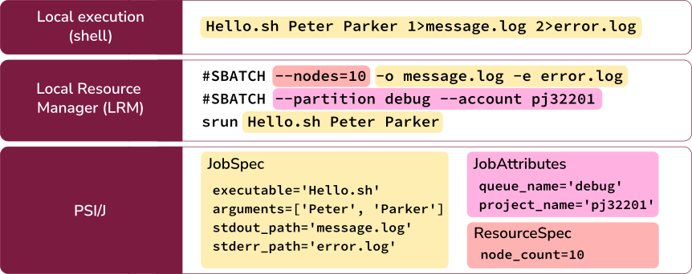

User Guide
==========

PSI/J is a Python library for submitting and managing HPC jobs via arbitrary
Resource Managers (RMs). PSI/J abstracts the specific RM, making your code
RM-independent and portable. Currently, PSI/J supports the following RMs: Slurm,
LSF, Flux, Cobalt, PBS and local Linux OS.

Terminology
-----------

In PSI/J’s terminology, a :class:`Job <psij.job_executor.Job>` represents an
executable plus its attributes.  Static job attributes such es resource
requiremens are defined by the JobSpec at creation, dynamic job attributes such
as the JobState are updated by PSI/J at runtime.

A :class:`JobExecutor <psij.job_executor.JobExecutor>` represents
a specific RM, e.g. Slurm, on which the Job is being executed.  Generally, when
jobs are submitted, they will be queued for a variable period of time, depending
on how busy the target machine is. Once the Job is started, its executable is
launched and runs to completion.

In PSI/J, a job is submitted by binding a Job object to a JobExecutor object
with an appropriate configuration. For example, one Job instance bound to
a JobExecutor object might represent a job submitted to LSF on ORNL Frontier,
another a job submitted to Slurm on NERSC Perlmutter, another a job submitted to
a Flux instance that runs in the cloud, and so on.

What is a JobExecutor?
----------------------

`JobExecutor.submit` creates a new resource manager job and
permanently binds the Job to it. Alternatively, a Job can be bound to an
existing resource manager job by calling JobExecutor.attach, passing in a Job
and the ID of the underlying resource manager job.

Submitting your job
-------------------

The most basic way to use PSI/J looks something like the following:

1. Create a JobExecutor instance.
2. Create a JobSpec object and populate it with information about your job.
3. Create a Job with that JobSpec.
4. Submit the Job instance to the JobExecutor.

That’s all there is to it! Assuming there are no errors, you should see a new
entry in your resource manager’s queue. On a Slurm cluster, this code might look
like: from psij import Job, JobExecutor, JobSpec

.. code-block:: python

    ex = JobExecutor.get_instance('slurm')
    job = Job(JobSpec(executable='/bin/date'))
    ex.submit(job)

And by way of comparison, here is the same functionality on an LSF cluster:
from psij import Job, JobExecutor, JobSpec

.. code-block:: python

    ex = JobExecutor.get_instance('lsf')
    job = Job(JobSpec(executable='/bin/date'))
    ex.submit(job)

Note that the only difference is the argument to the get_instance method.

Configuring your job
--------------------

In the example above, the `executable='/bin/date'` part tells PSI/J that we want
the job to run the `/bin/date` command. But there are other parts to the job
which can be configured:

- arguments for the job executable
- environment the job is running it
- destination for standard output and error streams
- resource requirements for the job's execution
- accounting details to be used

That information is encoded in the JobSpec which is used to create the Job
instance.

Job Arguments
^^^^^^^^^^^^^

The executable's command line arguments to be used for a job are specified as
a list of strings in the arguments attribute of the JobSpec class.  For example,
our previous `/bin/date` job could be changed to request UTC time formatting:

.. code-block:: python

    from psij import Job, JobExecutor, JobSpec

    ex = JobExecutor.get_instance('slurm')
    job = Job(JobSpec(executable='/bin/date', arguments=['-u']))
    ex.submit(job)

Note: JobSpec attributes can also be added incrementally:

.. code-block:: python

    from psij import JobSpec

    spec = JobSpec()
    spec.executable = '/bin/date'
    spec.arguments = ['-u']

Job Environment
^^^^^^^^^^^^^^^

The Job environment consists of ...

Job StdIO
^^^^^^^^^

Job Resources
^^^^^^^^^^^^^

Other Job Attributes
^^^^^^^^^^^^^^^^^^^^

Monitoring your job
-------------------

Getting status
^^^^^^^^^^^^^^

In all the above examples, we have submitted jobs without checking on what
happened to them. Once that command has finished executing (which, for /bin/date
should be almost as soon as the job starts) the resource manager will mark the
job as complete, triggering PSI/J to do the same via the `JobStatus` attribute
of the Job.

.. image:: states.png

To wait for a job to complete once it has been submitted, it suffices to call the wait method with no arguments:
from psij import Job, JobExecutor, JobSpec

.. code-block:: python

    from psij import Job, JobExecutor, JobSpec

    job = Job(JobSpec(executable='/bin/date'))
    ex.submit(job)
    job.wait()

The wait call will return once the job has reached a terminal state, which
almost always means that it finished or was cancelled.

To distinguish jobs that complete successfully from ones that fail or are
cancelled, fetch the status of the job after calling wait:

.. code-block:: python

    job.wait()
    print(str(job.status))

Status Callbacks
^^^^^^^^^^^^^^^^

Waiting for jobs to complete with wait is fine if you don’t mind blocking while
you wait for a single job to complete. However, if you want to wait on multiple
jobs without blocking, or you want to get updates when jobs start running, you
can attach a callback to a JobExecutor which will fire whenever any job
submitted to that executor changes status.

To wait on multiple jobs at once:

.. code-block:: python

    import time
    from psij import Job, JobExecutor, JobSpec

    count = 100

    def callback(job, status):
        global count

        if status.final:
            print(f"Job {job} completed with status {status}")
            count -= 1

    ex = JobExecutor.get_instance('flux')
    ex.set_job_status_callback(callback)
    for _ in range(count):
        job = Job(JobSpec(executable='/bin/date'))
        ex.submit(job)

    while count > 0:
        time.sleep(0.01)

Setting outputs
^^^^^^^^^^^^^^^

Dealing with errors
-------------------

Canceling your job
-------------------

Running Psi/J at your site
--------------------------

Pages should contain:

- A simple example ported to multiple sites showing how to configure PSI/J for
  each site with required configuration / attributes (with site-switcher?)
  (Each example should be in the test suite)
- Common errors you might encounter
- ‘If your site isn’t listed, please contact us to include it’

Running at LLNL LC
^^^^^^^^^^^^^^^^^^

Running at OLCF
^^^^^^^^^^^^^^^

Running at NERSC
^^^^^^^^^^^^^^^^

Running at ALCF
^^^^^^^^^^^^^^^

