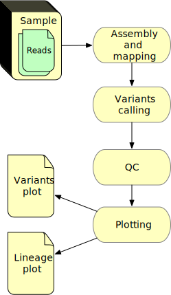

# Workflow examples

## PDF to Cloud Image

Input: PDF
Output: png

Scripts:
- pdftotext
- wordcloud_cli.py
- pdf2wordcloud.sh

Steps:


1. extract text from PDF file

    `pdftotext INPUT.pdf OUTPUT.txt`

2. create image from text

    `wordcloud_cli.py --text OUTPUT.txt --imagefile IMAGE.png`

Example:

```
import psij

jex = psij.JobExecutor.get_instance('slurm')

N=1 # number of jobs to run

def make_pdf2text_spec(input: File = None , output: str = None ):
    spec = psij.JobSpec()
    spec.executable = 'pdftotext'
    spec.arguments = [input,output]
    spec.attributes.set
    
    return spec

def make_text2wordcloud_spec(input, output):
    spec = psij.JobSpec()
    spec.executable = 'wordcloud_cli.py'
    spec.arguments = [input,output]

    return spec

def make_singularity_spec(  image: File = None, 
                            bind_input: [Path] = [],
                            bind_output: [Path] = [],
                            command: str = '',
                            options: [str] : []
                            ):
    spec = psij.JobSpec()
    spec.executable = 'singularity'
    bind = ''
    for f in bind_input :
        bind += " ".join(["--bind",f])
    for f in bind_output :
        bind += " ".join(["--bind",f])   
    spec.arguments = ['run', bind, image].append(options)

def make_job(spec , attributes):
    job = psij.Job()
    job.spec = spec
    return job


pdf2textSpec = make_pdf2text_spec("my.pdf" , "words.txt")
text2wordcloudSpec = make_text2wordcloud_spec()

pdf2textJob = make_job(pdf2textSpec)
text2wordcloudJob = make_job(text2wordcloudSpec)

for j in [ pdf2textJob , text2wordcloudJob ] :
    jex.submit(j)
    j.wait()

```


Docker:
```
FROM ubuntu:latest
RUN apt-get update && apt-get upgrade -y
RUN apt-get install -y \
  poppler-utils \
  python-pip
RUN pip install wordcloud
```


## Environmental COVID Workflow

Wastewater samples are collected and then concentrated to select for viral particles. RNA is then extracted from the concentrated viral solution. This RNA is prepped for sequencing using an amplicon panel targeting the entire [SARS-CoV-2 genome](https://www.ncbi.nlm.nih.gov/sars-cov-2/), and then sequenced. Resulting sequence files are the input for the pipeline below. The sequences are assembled and reads are mapped against the SARS-CoV-2 reference genome for variant detection.



This workflow consists of four major steps or jobs:

1. Sequence mapping
2. Variant calling
3. Quality control and filtering
4. Group and plot results for all samples

The tools are packaged in docker/singularity containers. The job spec documents for the jobs above have the follwoing format:

```
spec = psij.JobSpec()
    spec.executable = 'singularity'
    spec.arguments = ['run' , "-bind" , $directory , $tool , $option ]
    spec.stdout_path = 'log.stdout'
    spec.attributes
```

